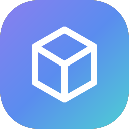

# کیوب‌ساز

### ربات آماده فروش VPN در تلگرام

بدون هاست · بدون سرور · بدون دانش فنی

[**🚀 شروع رایگان**](https://t.me/cubesaz) · [**📋 فهرست ۱۵۳ قابلیت**](https://cubepy.github.io/cubesaz-site/#features) · [**📢 کانال**](https://t.me/CubeSaz)

---

## برای چه کسی ساخته شده؟

اگر VPN می‌فروشید و خسته شده‌اید از اینکه نصفه‌شب بیدار شوید تا کانفیگ
بفرستید، رسید کارت‌به‌کارت چک کنید، یا یادتان بیفتد به مشتری بگویید سرویسش
دارد تمام می‌شود — کیوب‌ساز همه‌ی این‌ها را برمی‌دارد.

پنل‌های خودتان را وصل می‌کنید، قیمت می‌گذارید، تمام. بقیه‌اش با ربات است.

## در سه قدم راه می‌افتید

| | |
|:--:|---|
| **۱** | وارد [@CubeSaz_bot](https://t.me/cubesaz) می‌شوید |
| **۲** | نام برندتان و توکنی که از BotFather گرفته‌اید را می‌فرستید |
| **۳** | چند دقیقه بعد ربات فروش، پنل مدیریت و اپلیکیشن اختصاصی‌تان آماده است |

نه سروری می‌خرید، نه چیزی نصب می‌کنید، نه یک خط کد می‌نویسید.

## چه چیزی تحویل می‌گیرید

| | |
|---|---|
| 🤖 **ربات فروش اختصاصی** | مشتری مستقیم از داخل تلگرام می‌خرد |
| 🖥 **پنل مدیریت تحت وب** | کاربران، سرویس‌ها، قیمت‌ها، تخفیف‌ها و گزارش مالی |
| 📱 **اپلیکیشن داخل تلگرام** | فروشگاه و کارت اشتراک برای مشتری |
| 💳 **پرداخت خودکار** | کارت‌به‌کارت با تأیید آنی پیامکی، درگاه ریالی، رمزارز، استارز و کیف پول |
| ⚡️ **تحویل و تمدید خودکار** | یادآوری انقضا و هشدار اتمام حجم، بدون دخالت شما |
| 🛟 **بکاپ خودکار** | هر ۶ ساعت، روی کانال خصوصی خودتان — بدون تنظیمات فنی |
| 🤝 **نمایندگی و معرفی** | سطح‌بندی قیمت، پورسانت، کد تخفیف و کش‌بک |

## روی پنل‌هایی که همین حالا دارید

مرزبان · ثنایی (3X-UI) · هیدیفای · مرزنشین · پاسارگارد · Remnawave · S-UI · Guard · IBSng · Mikrotik · WGDashboard · علیرضا تک‌پورت

همه هم‌زمان، روی یک ربات.

## شروع کنید

**سه روز تست کاملاً رایگان** — بدون کارت بانکی، بدون تعهد.

### [🚀 شروع در تلگرام](https://t.me/cubesaz)

## پشتیبانی

از داخل همان ربات، بخش پشتیبانی — در تمام مدت اشتراک همراه شما هستیم.

---

© کیوب‌ساز — تمامی حقوق محفوظ است. این مخزن فقط شامل صفحه‌ی معرفی است و کدی در آن منتشر نمی‌شود.

